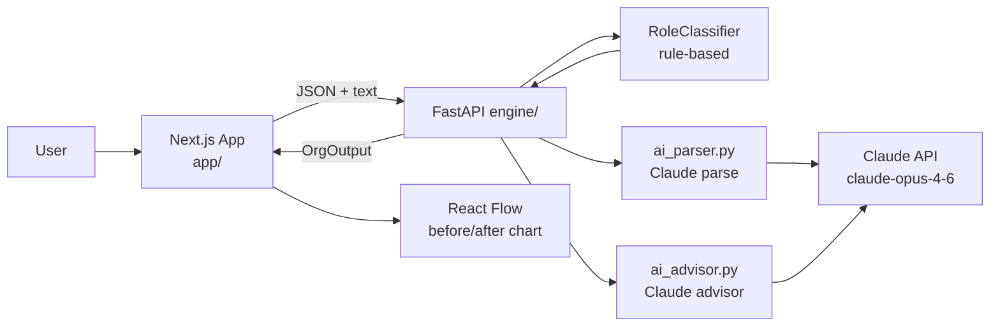

# org-intelligence-redesigner

> Turn a hierarchical org chart into an intelligence-era redesign — replace routing
> managers with world-model systems, and reclassify every role as an **IC**, a
> **DRI**, or a **Player-Coach**.

Based on Block's essay *"From Hierarchy to Intelligence"*. This tool operationalises
the framework: paste (or describe) your org, and get back a concrete redesign with
before/after visualisations, role-by-role reasoning, and a Claude-generated 90-day
transition plan.


---

## What this does

1. **Ingest** a current org chart — JSON, one of three bundled templates
   (startup-50, midsize-500, enterprise-5000), or a free-form natural-language
   description parsed by Claude.
2. **Classify** every role against the 4-layer intelligence-era model
   (Capability / WorldModel / Intelligence / Interface) and assign a new role
   type (IC / DRI / Player-Coach / Eliminated) using a rule-based engine that
   reasons over how each person spends their time.
3. **Score** each role's *redundancy* — roughly, the fraction of the role's
   value that a world-model system could absorb.
4. **Visualise** the before and after as interactive org charts using React
   Flow, colour-coded by new role type.
5. **Draft a 90-day transition plan** via Claude: which roles to reclassify
   first, what telemetry and context stores to build, how to redeploy
   eliminated headcount, and the top change-management risks.

## The framework in one paragraph

Hierarchies were invented to route information and decisions through human
coordinators because no shared context store existed. With modern AI, the
routing layer can be replaced by a **world model** — a live, machine-readable
representation of the business that every human can query directly. In that
world, management collapses into three roles: **ICs** who do the work,
**DRIs** who own outcomes end-to-end, and **Player-Coaches** who lift other
humans while still shipping. Everyone else — project coordinators, status-
meeting organisers, approvers, routers — is a tax on the system and should be
redeployed into value-creating work. Read `docs/framework.md` for the full
essay and `docs/mapping-guide.md` for the archetype-to-layer mapping table.

---

## Quick start

```bash
# 1. Clone
git clone https://github.com/techpolicycomms/Org-redesign.git
cd Org-redesign

# 2. Engine (FastAPI)
python -m venv .venv && source .venv/bin/activate
pip install -r engine/requirements.txt
cp .env.example .env  # then edit .env and set ANTHROPIC_API_KEY
uvicorn engine.main:app --reload --port 8000

# 3. App (Next.js) — in a second terminal
cd app
npm install
npm run dev  # http://localhost:3000
```

Open http://localhost:3000, pick a template or describe your org in plain
English, and click **Analyse**.

### Environment variables

| Variable             | Where          | Purpose                                                |
| -------------------- | -------------- | ------------------------------------------------------ |
| `ANTHROPIC_API_KEY`  | repo-root `.env` | Required for `/api/parse-text` and `/api/transition-plan`. |
| `NEXT_PUBLIC_API_BASE` | `app/.env.local` | Override the FastAPI base URL (default `http://localhost:8000`). |

---

## Architecture



- **`engine/`** — Pydantic schemas, a deterministic rule-based classifier, and
  two Claude-backed modules (`ai_parser.py` for NL → structured org,
  `ai_advisor.py` for the transition plan).
- **`app/`** — Next.js 14 (App Router) + Tailwind + Zustand + @xyflow/react.
- **`templates/`** — Three validated sample orgs (50 / 500 / 5000 headcount).
- **`docs/`** — The framework essay and archetype mapping guide, rendered
  verbatim at `/framework` in the UI.

---

## API reference

All endpoints live under `http://localhost:8000`.

### `GET /api/health`

```bash
curl http://localhost:8000/api/health
# {"status":"ok"}
```

### `GET /api/templates/{name}`

`name` ∈ `{startup-50, midsize-500, enterprise-5000}`.

```bash
curl http://localhost:8000/api/templates/startup-50
```

### `POST /api/classify`

Body: `OrgInput`. Returns `OrgOutput` with redesigned roles + summary stats.

```bash
curl -X POST http://localhost:8000/api/classify \
  -H "Content-Type: application/json" \
  -d @templates/startup-50.json
```

### `POST /api/classify-role`

Body: single `CurrentRole`. Returns a `RedesignedRole`.

### `POST /api/parse-text`

Body: `{"description": "We have a CTO managing 3 eng directors..."}`. Returns
a validated `OrgInput` produced by Claude.

```bash
curl -X POST http://localhost:8000/api/parse-text \
  -H "Content-Type: application/json" \
  -d '{"description": "We are a 30-person startup. Our CEO oversees a VP of Engineering with 12 engineers and a Head of Sales with 4 AEs."}'
```

### `POST /api/transition-plan`

Body: `{"org_input": OrgInput, "org_output": OrgOutput}`. Returns
`{"plan_markdown": "..."}` — a 90-day transition plan written by Claude.

---

## Roadmap

- [x] Rule-based classifier with redundancy scoring
- [x] React Flow before/after visualisation
- [x] Claude-backed natural-language org parsing
- [x] Claude-backed 90-day transition plan
- [ ] Multi-org comparison view
- [ ] CSV import for HRIS exports
- [ ] Custom rule authoring in the UI
- [ ] Cost-of-routing dollar estimation (salary × redundancy)
- [ ] Slack/Linear connectors to validate classifications against real activity

---

## Credits

The framework implemented here is from Block's essay
**"From Hierarchy to Intelligence"**. This repository is an independent
operationalisation of that framework and is not affiliated with Block.

Built by [@techpolicycomms](https://github.com/techpolicycomms). LLM work
powered by [Claude](https://claude.com/claude) (`claude-opus-4-6`).

## License

MIT — see `LICENSE`.
